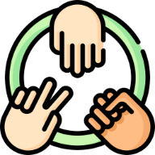
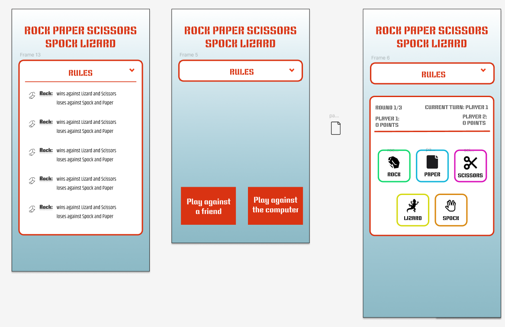
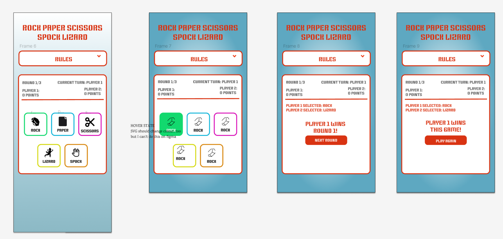

# Rock Paper Scissors Lizard Spock Game

Rock, Paper,Scissors, Lizard, Spock Game is a website for users want to play an online game that has elements of change.Provide a challenging game with options to select the limited number of tries before the game is over.

## Index – Table of Contents
* [User Experience (UX)](#user-experience-ux) 
* [Features](#features)
* [Design](#design)
* [Technologies Used](#technologies-used)
* [Testing](#testing)
* [Deployment](#deployment)
* [Credits](#credits)

## User Experience (UX)

-   ### User stories

    -   #### Display the result to user:
        1. In order to know if I won,lost or drew  as a user, I can see the result of the game after each round.
        2. In order to know which round I am now at as a user, I can see the current round information.
        3. In order to know what computer has selected as a game designer, I can see the result comparing with computer' selection.
        4. In order to know game result after used up all the tries in one game as a user, I can see the final result after all tries in one game.
        5. In order to know current score after each round as a user, I can see my score and the other player' score.

    -   #### Select option:
        1. In order to select from one of the five options:rock, paper, scissors,lizard, spock as a user, I can choose the one I want.
        2. In order to show the options to users as a game designer, I can display the five options to the users.
        3. In order to capture and process the user's selection as a game designer, I can get what the user has selected.
        4. In order to play with friend or play with computer as a user, I can choose who to play with to start the game.
	
    -   #### Rules:
        1. In order to understand the rules and play the game correctly as a user, I can see the clear instruction on how to play the game before start the game.
        2. In order to display the user the rules as a game designer, I can get user access the rules easily from the main game screen.
        3. In order to win the game as a user, I can see how the winner determined based on the rules of the game.

    -   #### Limited tries:
        1. In order to enjoy focused challenges as a user, I can choose the limited number of tries before it ends.
        2. In order to experience a defined game session with a clear goal and outcome as a user, I can play the game with the predefined numbers.
        3. In order to return to home or re-start another game after last try as a user, I can be displayed the option.
        4. In order to show users' overall performance throughout the limited attemps as a game designer, I can disply the user's final score after last try.

    -   #### Score tracking:
        1. In order to challenge during the game as a user, I can track the score across each round and see how well the performance is so far.
        2. In order to keep track of the scores as a game designer, I can display the scores to user to show detailed picture of the user' performance.
        3. In order to track the performance correctly as a game designer, I can implement logic to update the score based on the outcome of each round.
      

    -   #### Increasing difficulties:
        1. In order to thrive on challeges as a user, I can gradually increase in difficulty as progress.
        2. In order to continuously test and improve the skills as a user, I can try different difficulties.
        3. In order to provide and attract more users as a game designer, I can provide different difficulty levels.

    -   #### Responsive design:
        1. In order to get the game be accessbile and visually appealing on all devices as a site owner, I can provide responsive web pages.
        2. In order to play in different size devices and gain better user experience as a user, I can be provided the responsive web pages.
  
## Features 

### Existing Features

- __rule Area__

  - A drop down explains which option wins and loses against which of the other options. Players can access this information anytime to help them choose. 
  

- __startgame Area__

  - There are two options for user to choose. Either play with a friend or play with the  computer

- __select Area__

  - Featured on game starting page, it includes the five options for the users (player) to choose from.
  - This section will allow the user to easily select what they want.

- __result Area__

  - This section will show user the round result and the total result after last try in one game.

- __responsive Design__

  - This website is responsive to different screen sizes.

### Features Left to Implement

- Limited tries quantity to choose
  
- Increasing difficulty

  
## Design

-   ### Colour Scheme
    -  Agreed a couple colors would be used for our website elements in design and planning stage.

-   ### Typography
    - Google Fonts were used to import 'Keania One' fonts into styles.css.
 
       

-   ### Logo/Icon
    - The logo design incorporates the rock paper and scissors in a round.  The logo was generated using [favicon-converter](https://favicon.io/favicon-converter/)
 
	

-   ### Wireframes

    -   ####  Wireframe1

        
    -   ####  Wireframe2

        
    -   ####  Wireframe3
    
        
   

## Technologies Used

### Languages Used

-   [HTML5](https://en.wikipedia.org/wiki/HTML5)
-   [CSS3](https://en.wikipedia.org/wiki/Cascading_Style_Sheets)
-   [JavaScript ES6](https://en.wikipedia.org/wiki/JavaScript)

### Frameworks, Libraries & Programs Used

-   [Google Fonts:](https://fonts.google.com/) was used to import the 'Roboto Condensed' and 'Roboto' fonts into the style.css file which are used on all pages of the project.
-   [Font Awesome:](https://fontawesome.com/) was used to add icons for aesthetic and UX purposes.
-   [Git:](https://git-scm.com/) was used for version control by utilising the Gitpod terminal to commit to Git and Push to GitHub.
-   [GitHub:](https://github.com/) is used as the respository for the projects code after being pushed from Git.
-   [Figma:](https://www.figma.com/design/SqZL6FhkzGXVNvs4bazSra/Rock-Paper-Scissors-Lizard-Spock?node-id=0-1&t=VgGd6XmPVwHi5XPq-0)) was used to create the wireframes during the design process.
-   [favicon:](https://favicon.io/) was used for creating website logo icons.
-   [SVG icons:](https://www.svgrepo.com/) was used for the five option icons.
    

## Testing 

### Validator Testing 

- HTML
  - 4 errors were returned when passing through the official [W3C validator](https://validator.w3.org/nu/#textarea)
- CSS
  - No error was found when passing through the official [(Jigsaw) validator](https://jigsaw.w3.org/css-validator/validator)

### Unfixed Bugs

- Page content xxxxxxxxxxxxxxxxxxxxxxxxxx

## Deployment

- The site was deployed to GitHub pages. The steps to deploy are as follows: 
  - In the GitHub repository, navigate to the Settings tab
  - Click pages on the left side
  - In the branch section, use the drop down menu to select the main branch
  - Click save, and then wait for the deployment to be generated
  - Click visit site button at top of settings

The live link can be found here - https://xxx.html

## Credits 

### Content 

- The layout was influenced by the following code institute projects:
	- [Love Running](https://github.com/Code-Institute-Solutions/love-running-v3/tree/main/8.1-testing-and-validation)
	- [Love Rosie](https://github.com/Code-Institute-Solutions/resume-miniproject-bootstrap4/tree/master)
- The following xxx used for all factual information:
	- 
 	- 
  
- The icons in the footer were taken from [Font Awesome](https://fontawesome.com/)

### Media

- The icons were taken from [Font Awesome](https://fontawesome.com/)
- The fonts used were imported from [Google Fonts](https://fonts.google.com/)

- Images were sourced from www.freepik.com, and taken from the following web pages:
	- https://www.freepik.com/icon/rock-paper-scissors_683187

[def]: assets/documentation/wireframes/wireframe3.png
